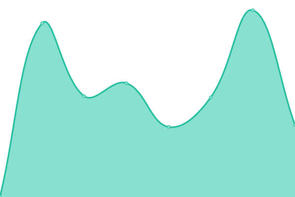
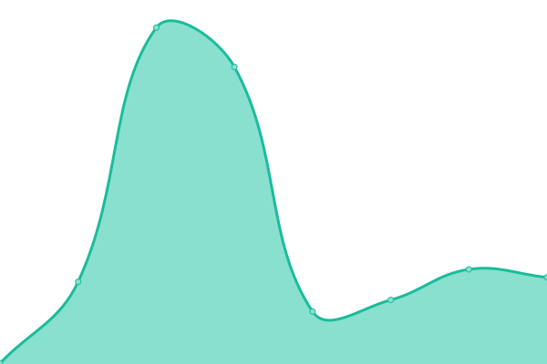
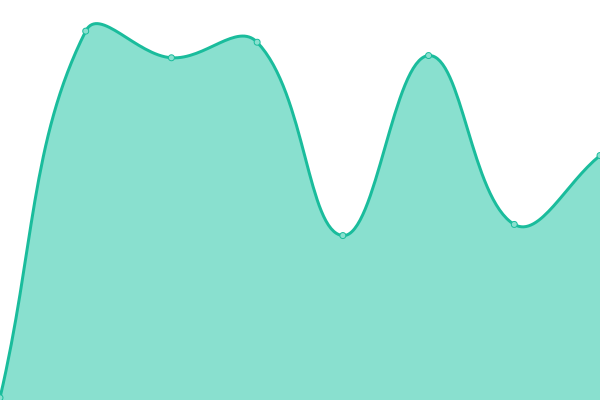

# [📈 Live Status](https://klp18.github.io/upptime): <!--live status--> **🟩 All systems operational**

This repository contains the open-source uptime monitor and status page for [klp18](https://klp18.github.io/upptime), powered by [Upptime](https://github.com/upptime/upptime).

With [Upptime](https://upptime.js.org), you can get your own unlimited and free uptime monitor and status page, powered entirely by a GitHub repository. We use [Issues](https://github.com/klp18/upptime/issues) as incident reports, [Actions](https://github.com/klp18/upptime/actions) as uptime monitors, and [Pages](https://klp18.github.io/upptime) for the status page.

<!--start: status pages-->
<!-- This summary is generated by Upptime (https://github.com/upptime/upptime) -->
<!-- Do not edit this manually, your changes will be overwritten -->
<!-- prettier-ignore -->
| URL | Status | History | Response Time | Uptime |
| --- | ------ | ------- | ------------- | ------ |
|  [HASO Web App](https://analytics.harepoint365.com/) | 🟩 Up | [haso-web-app.yml](https://github.com/klp18/upptime/commits/HEAD/history/haso-web-app.yml) | 

 324ms
     
 | 

<a href="https://klp18.github.io/upptime/history/haso-web-app">100.00%</a>
    

|  [HASO CDN](https://cdn.analytics.harepoint365.com/Scripts/track.js) | 🟩 Up | [haso-cdn.yml](https://github.com/klp18/upptime/commits/HEAD/history/haso-cdn.yml) | 

 162ms
     
 | 

<a href="https://klp18.github.io/upptime/history/haso-cdn">100.00%</a>
    

|  [Homepage](https://www.harepoint.com/) | 🟩 Up | [homepage.yml](https://github.com/klp18/upptime/commits/HEAD/history/homepage.yml) | 

 154ms
     
 | 

<a href="https://klp18.github.io/upptime/history/homepage">100.00%</a>
    

<!--end: status pages-->

[**Visit our status website →**](https://klp18.github.io/upptime)

## 📄 License

- Powered by: [Upptime](https://github.com/upptime/upptime)
- Code: [MIT](./LICENSE) © [Anand Chowdhary](https://anandchowdhary.com), supported by [Pabio](https://pabio.com)
- Data in the `./history` directory: [Open Database License](https://opendatacommons.org/licenses/odbl/1-0/)
